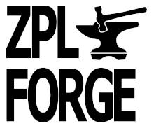
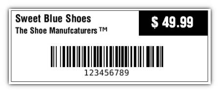

The ZPLForge library is aimed at people who do not want to deal directly with **ZPL II** or read the
documentation for hours. ZPLForge creates ZPL code in no time with special builders that
guide user in easy steps.
Another advantage is the XML serialization which comes with the
*ZPLForge.XmlSerialization* package. With this, the label is saved in XML format
in a file or string that is easy to read and adaptable to third parties.

##### What this library is not

This library is not about talking to printers. Not even 
for generating GRF from bitmaps. The goal of this is to stay lightweight and 
free of dependencies.

#### Package infos

| Package                       | Target framework  | NuGet                                                                                                                                   | CI build (master)                                                                                    | CI build (develop)                                                                                   |
| ----------------------------- | ----------------- | --------------------------------------------------------------------------------------------------------------------------------------- | ---------------------------------------------------------------------------------------------------- | ---------------------------------------------------------------------------------------------------- |
| **ZPLForge**                  | .NET Standard 2.0 | [](https://www.nuget.org/packages/ZPLForge/)                                    |  | |
| **ZPLForge.XmlSerialization** | .NET Standard 2.0 | [](https://www.nuget.org/packages/ZPLForge.XmlSerialization/)  |  | |

#### Supported label content
- Text
- Ellipse
- Rectangle
- Barcode (Code39, Code128, EAN8, EAN13, UPC-A, UPC-E)
- QR Code
- Symbol
- Image
- Diagonal Line

## Label builder
Using the `LabelBuilder` is recommended, because all required properties on the labels (and its content) will be set. Additionally this brings some validation.

### Example
This example is printed on a adhesive label with a total width of 60 mm on a ZD420
printer. This printer prints with a resolution of 203 dpi, so I calculated the total width in dots as
follows:   
(60 mm / 25.4) * 203 dpi = 480 dots   

*Remark: All sizes in ZPLForge are given in dots!*

``` csharp
Label priceLabel = LabelBuilder
    .FromCuttedContinuousMedia(480, 200, MediaType.ThermalTransfer)
    .SetQuantity(1)
    .AdjustDarknessLevel(+12)
    .AddText(txt => txt
        .At(15, 30)
        .SetContent("Sweet Blue Shoes")
        .SetFont(Font.Default, 25))
    .AddText(txt => txt
        .At(15, 60)
        .SetContent("The Shoe Manufcaturers")
        .SetFont(Font.Default, 20))
    .AddSymbol(sym => sym
        .At(220, 60)
        .SetSymbol(SymbolKind.TradeMark, 10, 10))
    .AddCode128Barcode(c128 => c128
        .At(100, 105)
        .SetHeight(50)
        .SetContent("123456789"))
    .AddRectangle(circle => circle
        .At(310, 20)
        .SetDimensions(165, 60)
        .SetBorder(LabelColor.Black, 60))
    .AddText(txt => txt
        .At(310, 35)
        .ApplyBlockMode(170, 1, BlockAlignment.Center)
        .SetContent("$ 49.99")
        .SetFont(Font.S, 20)
        .InvertColors())
    .AddRectangle(rect => rect
        .At(5, 20)
        .SetDimensions(470, 170)
        .SetBorder(LabelColor.Black, 1))
    .Build();

string zpl = priceLabel.ToString();
```

ZPL string generated by the builder above:
``` zpl
^XA^LL200^MNN,0^PW480^MMC^MD12^MTT^PQ1,0,0,N,Y^CI28^PR2,6,2^FO15,30,0^FDSweet Blue Shoes^A0I,25,^FS^FO15,60,0^FDThe Shoe Manufcaturers^A0N,20,^FS^FO220,60,0^GSN,10,10^FDC^FS^FO100,105,0^BY2,3.0,10^BCN,50,Y,N,N^FD123456789^FS^FO310,20,0^GB165,60,60,B,0^FS^FO310,35,0^FR^FD$ 49.99^ASN,20,^FB170,1,0,C^FS^FO5,20,0^GB470,170,1,B,0^FS^XZ
```

The printed label:



### Factory methods   

Depending on the label which is inserted, choose one of the factory methods below to create a `LabelBuilder` instance.

``` csharp
LabelBuilder.FromWebSensingMedia(int printWidth, PrintMode? printMode = null, MediaType? mediaType = null);

LabelBuilder.FromContinuousMedia(int printWidth, int labelLength, PrintMode? printMode = null, MediaType? mediaType = null);

LabelBuilder.FromCuttedContinuousMedia(int printWidth, int labelLength, MediaType? mediaType = null);

LabelBuilder.FromBlackMarkSensingMedia(int printWidth, int blackMarkOffset, PrintMode? printMode = null, MediaType? mediaType = null);
```   
   
### Builder Extensibility

All builders can be extended with normal C# extension methods:

``` csharp
public static class BuilderExtensions
{
    public static ImageBuilder FromBitmap(this ImageBuilder self, Bitmap bitmap)
    {
        ImageElement image = (self as IContextAccessor<ImageElement>).Context;
        image.Content = /* insert bitmap data */;
        image.BinaryByteCount = /* insert bitmap data */;
        /* ... */		
        return self;
    }
}
```

## Usage without builders

To get full control over the label and to be able to set all properties manually, the
`Label` (including the content elements like `TextElement`) class can be used directly.
This would make it possible to create your own builders.

``` csharp
Label priceLabel = new Label {
    Quantity = 1,
    PrintWidth = 480,
    MediaTracking = MediaTracking.Continuous,
    MediaType = MediaType.ThermalTransfer,
    PrintMode = PrintMode.Cutter,
    MediaDarknessLevel = 12,
    Content = {
        new TextElement {
            PositionX = 15,
            PositionY = 15,
            Content = "Sweet Blue Shoes",
            CharHeight = 25
        },
        new BarcodeElement {
            BarcodeType = BarcodeType.Code128
            /* ... */
        }
        /* ... */
    }
};
```

## XML Serialization

### Serialization

To save the information in a human readable format without knowing much about ZPL, take a
look at the `LabelXmlSerializer` class inside the *ZPLForge.XmlSerialization*
package.

``` csharp
using var fileStream = File.Create("priceLabel.xml");
var serializer = new LabelXmlSerializer();
serializer.Serialize(fileStream, priceLabel);
```

This will output the `Label` and its content in easy to read (and editable) XML format:

``` xml
<?xml version="1.0"?>
<Label version="0.1.0-beta">
  <MediaTracking>Continuous</MediaTracking>
  <PrintWidth>480</PrintWidth>
  <PrintMode>Cutter</PrintMode>
  <MediaType>ThermalTransfer</MediaType>
  <MediaDarknessLevel>12</MediaDarknessLevel>
  <Content>
    <Text>
      <PositionX>15</PositionX>
      <PositionY>30</PositionY>
      <Content>Sweet Blue Shoes</Content>
      <CharHeight>25</CharHeight>
    </Text>
    <Symbol>
      <PositionX>215</PositionX>
      <PositionY>60</PositionY>
      <Height>10</Height>
      <Width>10</Width>
      <Content>TradeMark</Content>
    </Symbol>
    <Barcode>
      <PositionX>100</PositionX>
      <PositionY>105</PositionY>
      <Content>123456789</Content>
      <Height>50</Height>
    </Barcode>
    <!-- ... -->
  </Content>
</Label>
```

To serialize default values (disabled by default) use the `serializeDefaults`
parameter on `LabelXmlSerializer`:

```
serializer.Serialize(fileStream, priceLabel, serializeDefaults: true);
```

### Deserialization

To consume such label XML files, we use the `LabelXmlSerializer` again:

``` csharp
using var fileStream = File.OpenRead("priceLabel.xml");
var serializer = new LabelXmlSerializer();
Label priceLabel = serializer.Deserialize(fileStream);
```
